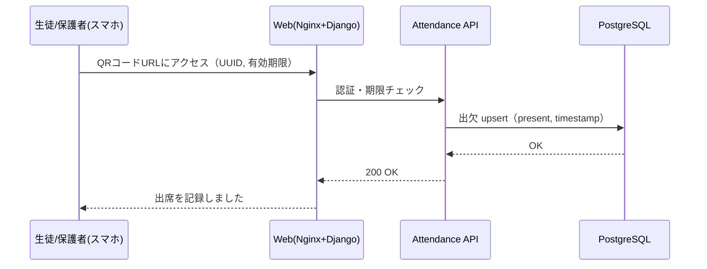

```mermaid
sequenceDiagram
  participant U as 生徒/保護者(スマホ)
  participant W as Web(Nginx+Django)
  participant A as Attendance API
  participant DB as PostgreSQL

  U->>W: QRコードURLにアクセス（UUID, 有効期限）
  W->>A: 認証・期限チェック
  A->>DB: 出欠 upsert（present, timestamp）
  DB-->>A: OK
  A-->>W: 200 OK
  W-->>U: 出席を記録しました
```
